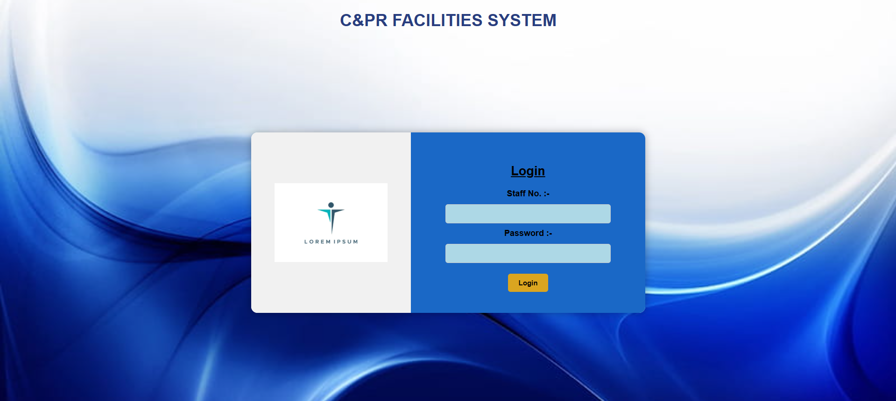
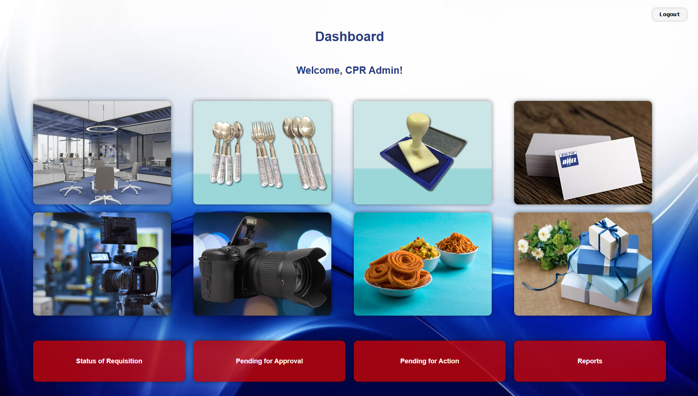

# Requisition Management System

The Requisition Management System is a modular, and user-friendly web application designed to streamline internal requisition workflows across multiple departments at any company. It facilitates a structured approach to submitting, approving, and monitoring requests for various resources such as furniture, cutlery, visiting cards, and event-related services.

Built using PHP and MySQL, the system provides role-based access for both staff members and administrators, ensuring that each requisition follows a defined lifecycle from draft to final closure. With features like centralized data storage, status tracking, remark recording, and category-specific workflows, the tool eliminates the need for paperwork and manual follow-ups significantly improving operational transparency and turnaround times.

The application supports eight different requisition categories, each with its own customized form and status tracking mechanism. Administrative users can view pending submissions, approve or reject requests, and assign final status updates, while general users can track the progress of their requests in real-time.

---

## 🚀 Features

- 🔐 **User Authentication**  
  Login system with session-based role management for normal users and admin users.

- 📝 **Category-wise Requisition Forms**  
  Eight different categories supported:
  - Furniture
  - Cutlery
  - Stamps
  - Visiting Cards
  - Photopgrahy
  - Videography
  - Beverages & Snacks
  - Mementoes & Gifts

- ✅ **Approval Workflow**  
  Admins can review, approve, and update status of requests via dedicated approval/action pages.

- 📊 **Request Status Tracking**  
  Staff can view the status and remarks of their submitted requisitions in real-time.

- 🔍 **Admin Report Panel**  
  Filter requests by staff number and category with detailed requisition history.

- 📥 **Excel Export** 
  Report page supports integration for downloadable Excel file.


<div align="center">
  <h2>Login Page</h2>
  
  
  <br><br>

  <h2>Admin Dashboard</h2>
  
</div>

---

## 🛠️ Tech Stack

- **Frontend:** HTML, CSS
- **Backend:** PHP
- **Database:** MySQL (via phpMyAdmin)

---

## 📁 Directory Structure

```bash
├── db.php                 # Database connection file
├── login.php              # Login page
├── logout.php             # Logout handler
├── dashboard.php          # Overall Dashboard
├── furniture.php          # Furniture requisition form
├── cutlery.php            # Cutlery requisition form
├── photography.php        # Photography requisition form
├── videography.php        # Videography requisition form
├── gifts.php              # Gifts requisition form
├── beverages.php          # Beverages & Snacks form
├── stamps.php             # Stamp requisition form
├── visitingcard.php       # Visiting card requisition form
├── approval_*.php         # Approval pages per category
├── action_*.php           # Post-approval action pages per category
├── status_*.php           # Requisition status pages per category
├── report.php             # Central search/reporting interface
└── README.md              # You're here
```

## 🔑 User Roles

| Role   | Description         |
|--------|---------------------|
| User   | Can log in, submit requisitions, and track status |
| Admin  | Admin role with approval, remarks, and reporting capabilities |

## 🧾 Database Schema (Overview)

- **staff_users**
  - `staff_no`, `password`, `name_staffno`, `contact`, `role`
- **REQIUIS_MASTER**
  - Requisition master table for common tracking (includes `req_id`, `staff_no`, `category_id`, `leg_id`, etc.)
- **leg_status_master**
  - `category_id`,  `leg_id`, `status_description`

## 🔄 Requisition Flow

1. **User Login**
2. **Submit Form (Draft)** → `leg_id = 0`
3. **Submit to Admin** → `leg_id = 1`
4. **Approval/Reject** → `leg_id = 2 / 3`
5. **Post-Approval Action by Services** → `leg_id = 4+` (category-specific)
6. **Final Close**

## 🧑‍💻 Local Setup Instructions

1. Install [XAMPP](https://www.apachefriends.org/index.html)
2. Place the `RMS` folder in `htdocs/`
3. Import the SQL database via `phpMyAdmin`
4. Start Apache and MySQL
5. Visit `http://localhost/RMS/login.php` in your browser

## 📬 Contact

For issues or contributions, contact author at **b.saiansh@gmail.com**